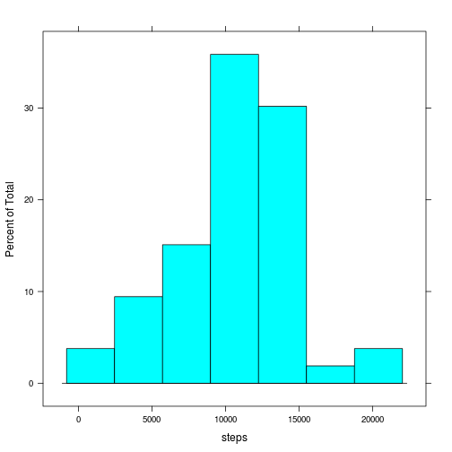
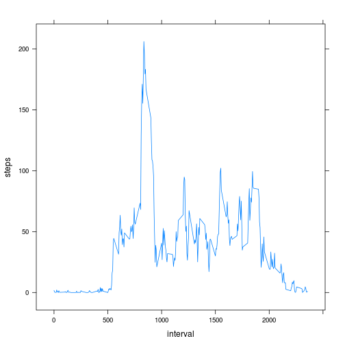
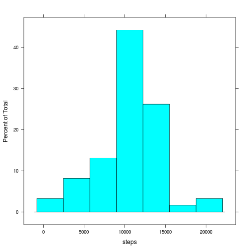
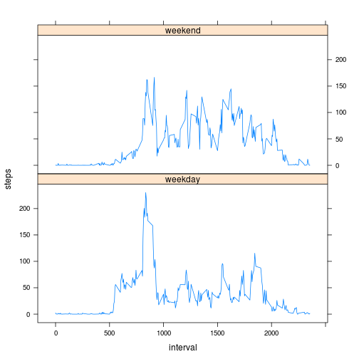

# Reproducible Research: Peer Assessment 1
#### Daniel Thomas (2014)

## Loading and preprocessing the data

```r
library(lattice)

activity <- read.csv("data/activity.csv")
activity$date <- as.Date(activity$date)
totals <- aggregate(steps ~ date, data = activity, FUN = sum)
```


## What is mean total number of steps taken per day?
Here is a histogram of the total numberof steps taken per day

```r
with(totals, histogram(steps))
```

 


```r
meanVal <- mean(totals$steps)
medianVal <- median(totals$steps)
```

The mean: **1.0766 &times; 10<sup>4</sup>**   
The median: **10765**


## What is the average daily activity pattern?

```r
daily <- aggregate(steps ~ interval, data = activity, FUN = mean)
maxInterval <- with(daily, daily[which(steps == max(steps)), "interval"])

xyplot(steps ~ interval, data = daily, type = "l")
```

 


The 5minute interval which had the highest average number of steps is **835**.

## Imputing missing values

```r
missingVals <- sum(is.na(activity$steps))
```

There are 2304 missing (NA) values in the data.

Missing values will be imputed by assigning them to the corresponding 5 minute Interval average.


```r
# Copy the original dataset and merge with daily
imputed <- merge(activity, daily, by = "interval")

# set steps.x to steps.y when NA
imputed[is.na(imputed$steps.x), "steps.x"] <- imputed[is.na(imputed$steps.x), 
    "steps.y"]

# cleanup
imputed$steps <- imputed$steps.x
imputed$steps.x <- NULL
imputed$steps.y <- NULL
```


This histogram shows the total number of steps per day using the imputed dataset

```r
imputedTotals <- aggregate(steps ~ date, data = imputed, FUN = sum)
with(imputedTotals, histogram(steps))
```

 


```r
meanImputedVal <- mean(imputed$steps)
medianImputedVal <- median(imputed$steps)
```

The mean: **37.3826**   
The median: **0**

Imputing the missing values in this manner significantly reduces the mean and medians of the dataset. As the median becomes 0, this indicates that the majority of the missing data is in periods where the average number of steps is 0.

## Are there differences in activity patterns between weekdays and weekends?


```r
imputed$weekDay <- as.factor(weekdays(imputed$date))
# the default, common case
imputed$isWeekDay <- "weekday"
imputed$isWeekDay[imputed$weekDay == "Saturday" | imputed$weekDay == "Sunday"] <- "weekend"
imputed$isWeekDay <- as.factor(imputed$isWeekDay)
imputedSummary <- aggregate(steps ~ interval + isWeekDay, data = imputed, FUN = mean)
xyplot(steps ~ interval | isWeekDay, data = imputedSummary, layout = c(1, 2), 
    type = "l")
```

 

